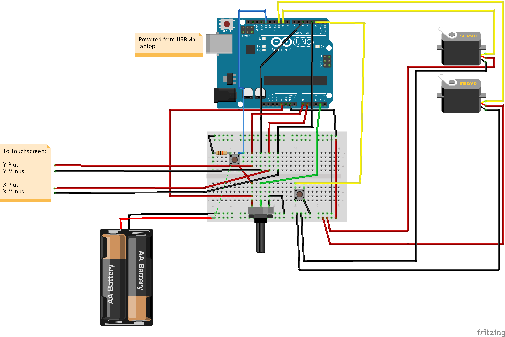

# Ball-Positioning-Control-System

The `Control_System.ino` sketch is what I used for this control system. Please find below a video of this project in action!

And here is a wiring diagram of the project:

